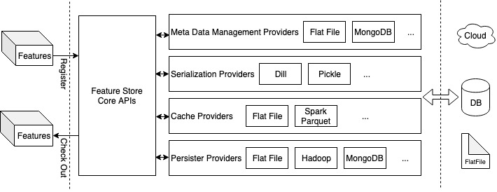

# Nebula
The Nebula is a lightweight feature store designed to streamline DSE working pipeline by sharing high-quality features among team members and enable the minimum amount of effort to reuse the features. It designs to be extensible and versatile to accommodate different team set up on different computation platform, including Waston Studio Local.

[](https://travis.ibm.com/Kai-Niu/nebula)

# Design

The Nebula is built for sharing features extracted using pySpark, but works for other framwork as well, e.g., pandas. The core idea is to share the feature extraction logic instead of actual dataset. The provider pattern enables the Nebula to work with different backend persistent layer such as MongoDB, Hive, etc. Cache Layer is used to address the performance issue when the actual feature extraction operation is computationally expensive.

# Install
```
pip install Nebula  #package is not published yet
```

# Configuration
* Step 1, Use the utility function generate the store configuration json file.
```python
 from nebula import ConfigBuilder
 config = ConfigBuilder()
 config.build('path_to_config_folder/store_config.json')
```

* Step 2, Edit the store_config.json based on the environment. The following is an example of the generated configuration file:

```javascript
{
    "store_name": "Kai's Feature Store",
    "meta_manager": "default",
    "meta_manager_providers": {
        "default":{
            "root_dir": "/Users/kai/repository/nebula/example/storage",
            "folder_name":"catalog",
            "file_name":"catalog.nbl"
        }
    },
    "persistor_providers":{
        "default":{
            "root_dir": "/Users/kai/repository/nebula/example/storage",
            "folder_name":"features"
        }
    },
    "serializer_providers":{
        "default":{
        }
    }
}
```

# Version
The package is still under concept-proofing phase. The plan is supported flat file and MongoDB as the persistent layers and sparks parquet as the cache layer in the release of the alpha version. As of now, the library only supports flat file as a persistent layer and no cache layer support.
