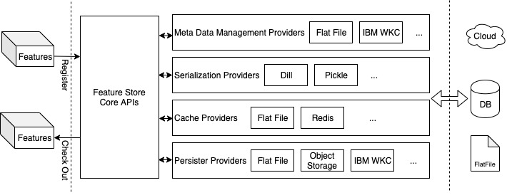

# Nebula
Nebula is a lightweight __feature store__ designed to streamline the DSE working pipeline by sharing high-quality features among team members and enable feature reuse with minimal effort. It designs to be extensible and versatile to accommodate different teams set up on different computation platform.

[](https://travis.ibm.com/Kai-Niu/nebula)

# Design

  

##### Intro 
Nebula is built for sharing features in pandas or pyspark dataframes; it could be extended to any arbitrary dataset format. The core idea is to share the feature extraction logic (_pipeline_) instead of the actual dataset. The _provider_ pattern enables Nebula to work with different back-end layers such as object storage, IBM knowledge catalog, etc. 

##### Extend by Providers
The _provider_ engineering pattern is used to extend the feature store and enable the deployment onto different infrastructures. A given function is abstracted as a provider method, and the feature store has no dependency on a specific implementation. For example, the feature store can work with multiple providers to persist features, and the specific mechanisms each provider has to persist data are decoupled from the feature store. In this design, the feature store can be extended without much change to its codebase. 

##### Organize by Namespace
The design purpose of supporting namespaces is to help organize the features into a manageable hierarchy. In environments with multiple teams and projects, the features produced from different projects become unmanageable quickly. The proposed design is to organize the features into different namespaces. In each namespace, the features’ meta-attributes such as "tags", "name", and "comments" can help filter the features further into meaningful sets. 


# Install
In general, use pip to install the package.
```
pip install DimStore 
# some folks used the name 'nebula' already...
```
* Watson Studio Cloud Pak For Data 2.5:

   - Open Jupyter Lab IDE.
   - Open Terminal window.
   - Use Pip command to install the package.


# Configuration
The package can work with different back-end layers based on a configuration file in JSON format. The configuration file contains five sections:

1. The general attributes:  

##### example:  

```javascript
{
   "store_name": "Kai's Feature Store",       # the name of the store
   "meta_manager": "ibm_wkc_meta_manager",    # the default meta manager layer
   "output_render": "html_render",            # the default output renderer layer
   "default_persistor": "ibm_wkc_storage",    # the default persistence layer
   "default_serializer": "dill_serializer",   # the default serialization layer
   "default_cache_layer": "none",             # the default cache layer
}
```

2. The `meta_manager` section configures the providers made available to manage feature metadata. The default `meta_manager` has to be chosen from the entities defined in this section. The supported metadata managers are:

   - Flat File
   - IBM Object Storage
   - IBM Knowledge Catalog  

##### example:  

```javascript
"meta_manager_providers": {
    "flat_file_meta_manager":{
            "root_dir": "/Users/kai/repository/nebula/example/storage",
            "folder_name":"catalog",
            "file_name":"catalog.nbl"
    },
    "ibm_object_storage_meta_manager":{
        "file_uid": "foo-bar-never-going-to-dup-uid-here",
        "iam_service_id": "iam-ServiceId-1915183a-47f4-4c9f-81c3-************",
        "ibm_api_key_id": "4r8w7hJilAQyo4VrdBqUnhbXA5qfratq**********_",
        "endpoint":"https://s3.us.cloud-object-storage.appdomain.cloud",
        "ibm_auth_endpoint": "https://iam.bluemix.net/oidc/token",
        "bucket": "foobar-bucket"
    },
    "ibm_wkc_meta_manager":{
        "asset_name": "metadata_manager_repository",
        "catalog_name": "DimStore",
        "uid": "dimstore",
        "token": "*******",
        "host": "dse-cp4d25-cluster2.cpolab.ibm.com"
    }
}
```
3. The `persistor` section configures all the providers made available to persist data to designated destinations. The default `persistor` has to be chosen from the entities defined in this section. The supported providers are:

   - Flat file
   - IBM Object Storage
   - IBM Waston Knowlege Catalog  

##### example:  

```javascript
"persistor_providers":{
     "flat_file_storage":{
         "root_dir": "/Users/kai/repository/nebula/example/storage",
         "folder_name":"features"
     },
     "ibm_object_storage":{
         "iam_service_id": "iam-ServiceId-1915183a-47f4-4c9f-81c3-************",
         "ibm_api_key_id": "4r8w7hJilAQyo4VrdBqUnhbXA5qfratq***********_",
         "endpoint":"https://s3.us.cloud-object-storage.appdomain.cloud",
         "ibm_auth_endpoint": "https://iam.bluemix.net/oidc/token",
         "bucket": "foobar-bucket"
     },
     "ibm_wkc_storage":{
         "catalog_name": "DimStore",
         "uid": "dimstore",
         "token": "******",
         "host": "dse-cp4d25-cluster2.cpolab.ibm.com"
     }
}
```
4. The cache layer is not supported yet, but the configuration design will be similar to the metadata manager and persistor providers.

5. The `serializer` and `output_renderer` sections configure the providers made available to serialize and render output. The supported providers are:

   - Serializer: dill
   - Output Renderer: Html renderer   

##### example:  

```javascript
 "serializer_providers":{
     "dill_serializer":{
     }
 },
 "output_render_providers":{
     "html_render":{
         "table_style":"border: 1px solid black"
     }
 }
```

# Tutorial

#### 1. Create the feature store object. 
The configuration file can be referred to as a local or remote file:   
```python
remote_config = 'https://s3.us.cloud-object-storage.appdomain.cloud/foobar-bucket/store_config.json'
local_config = 'file://store_config.json'
store1 = Store(local_config)
store2 = Store(remote_config)
```

##### example:   

  

#### 2. Check store namespace:
The aggregated feature counts of each namespace can provide a good summary of available features.
```python
store.list_namespaces()
```

##### example:   

   

#### 3. "Shopping" features:
There are multiple ways to check out features:
 - by namespace
 - by feature name
 - by filter function
```python
foo = store.features(namespace='foo.bar') # the namespace of features
           .select(
                keep=['foo1','foo2',...],  # list of features to keep in the specified namespace
                exclude=['bar1','bar2',...],  # list of features to exclude from the specified namespace
                filter=filter_function   # any arbitrary function: lambda feature: return bool
            )
```

##### example:   

   

After the set of feature is checked out from the store, build the dataset is simple:
```python
foo.build(dataframe='[pyspark|pandas]') # pyspark dataframe is default output dataframe
```
##### example:    

   


One of the advantages to storing features as pipelines is to check out feature with customized parameters:
```python
param_list = {
             'fully qualified feature name': params,
             'dse.client.abc.project1.zoo_scaler': {'alpha':-100}
          }
df2 = foo.build(dataframe='pandas',**param_list) # pass the param list 
```

##### example:   

   

#### 4. Create Features
The feature creation process requires minimal efforts on top of the normal feature extraction process. The easy way is to think of feature as a simple function that implements a certain contract (conventions):
  
1. return a data frame contain 'index' column and one or more feature(s) column(s).
2. function contains all logics required to produce the feature.  
  
The following example defined a simple feature by scaling the source data. It contains an independent pipeline from connection to the data source, applying the logics, and returning a feature data frame. The feature extraction pipeline can follow any arbitrary list of operations as long as the computation environment supports. 

```python
def foo_feature(col='X1', alpha=1.0):
    # read in data
    df = pd.read_csv('/project_data/data_asset/foo.csv')
    # scale the target column by scale coefficient and
    # return the feature dataframe
    return df.loc[:,['id',col]]*alpha
 ```
 
After defining the feature pipeline, few metadata need to be provided so others in the team can consume the feature with a minimum amount of effort. The list of meta data support in default:  

* name: the name of the feature.
* index: the index column of the returned feature dataframe.
* namespace: the namespace of the feature.
* author: as the name implies.
* tags: a set of tages that help organize the features.
* params: a dictionary of parameters
* output: the type of output dataframe ['pyspark'|'pandas']
* comment: as the name implies.
* persistor: the persistor provider associate with this feature. 'None' value implies the default persistor.
* serializer: the serializer provider associate with this feature. 'None' value implies the default serializer.  

The last step of registering a feature is to call the register function:  

```python
store.register(metadata, foo_feature)
```

##### example:  
  

#### 5. Update Feature Store
The features in the feature store can also be updated by the steps as following:

1. select the group of features into a set. It is similar to checking out features.
2. call 'update' or 'delete' function on the feature set.

```python
# delete all features in the set, 
# the hard delete will also delete feature from the persist layer.
foo.delete(hard=[true|false])

# update the features in the set
# the update can be specified as key-value pair or lambda function
foo.update( key_values = {'meta attribute: value', 'name':'kai niu', ...}, # the kvp of meta attributes
            updater = lambda feature: return feature, # the lambda updater function that take feature as input and output
            strict_mode = [true|false], # toggle strict mode, in default it is true.
            verbose = [true|false] # toggle verbose mode, in default it is false.
            )
```

# Contribute
The contribution comes in many ways:
* Documentation: the documentation of the repository, the tutorial of how to use the feature store.
* Unit Testing: since the feature store is a piece of software, therefore it has bugs, sloppy codes. The current code coverage is sloppy (about 45% percentage and the target is >= 85%), so help on writing unit tests is very much needed. 
* Feedbacks: try out the package in your DS pipeline and see how it works.
* New Features: add new features to the package. e,g., add Mongo DB as a new persist layer.
* Issues: The issues are these specific tasks need the help, so feel free to fork the repo and start working on them.


